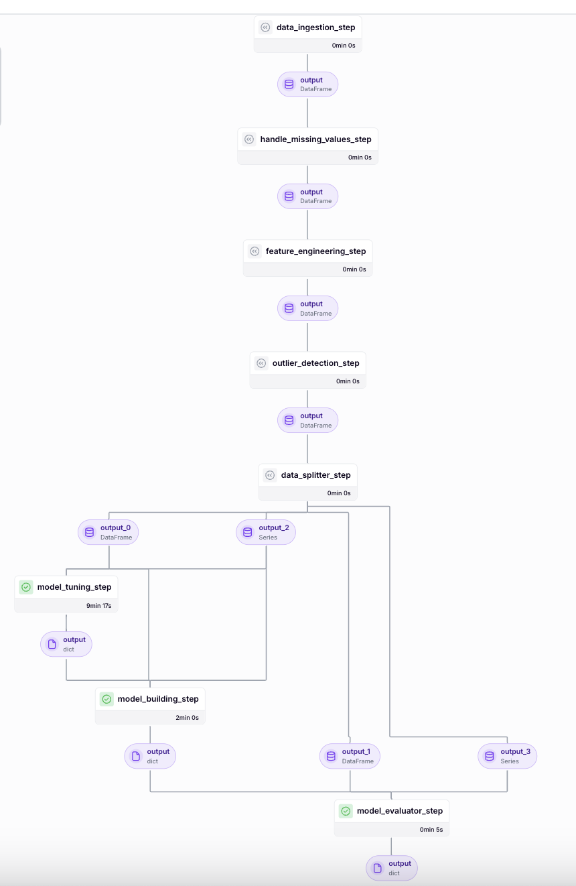

# Loan-Risk-Prediction-Model-Pipeline

This repository contains a complete machine learning pipeline, covering data ingestion, preprocessing, feature engineering, outlier detection, data splitting, model hyperparameter tuning, training, evaluation, and deployment using FastAPI. The pipeline also includes unit and integration tests to ensure the robustness of each component.


## Pipeline Diagram



## Project Structure

```
MLE/
│── analysis/                  # Exploratory Data Analysis (EDA) and feature analysis  
│   ├── analyze_src/           # Source files for different EDA techniques  
│   │   ├── basic_data_inspection.py  # Initial dataset overview (shape, types, summary stats)  
│   │   ├── bivariate_analysis.py     # Analyzes relationships between two variables  
│   │   ├── missing_values_analysis.py # Identifies and handles missing data  
│   │   ├── multivariate_analysis.py  # Explores interactions among multiple variables  
│   │   ├── univariate_analysis.py    # Examines distributions of individual features  
│   ├── EDA.ipynb              # Jupyter notebook summarizing exploratory data analysis  
│   ├── EDA.html               # HTML export of EDA.ipynb for quick viewing  
│  
│── evaluation_metrics/        # Stores evaluation metrics from model runs in .txt files  
│  
│── loanStatus_encoders/       # Stores label encoders for loan status in .pkl format  
│  
│── models_pipeline/           # Stores trained models and preprocessors in .pkl format  
│  
│── pipelines/                 # ML pipelines for model training and deployment  
│   ├── deployment_pipeline.py # Pipeline for deploying the trained model  
│   ├── training_pipeline.py   # Pipeline for training and evaluating the model  
│  
│── src/                       # Core machine learning processing scripts  
│   ├── data_splitter.py       # Splits dataset into training and testing sets  
│   ├── feature_engineering.py # Applies feature transformations and engineering techniques  
│   ├── handle_missing_values.py # Handles missing values (imputation, removal, etc.)  
│   ├── ingest_data.py         # Loads and preprocesses raw data from source files  
│   ├── model_evaluation.py    # Evaluates trained models using performance metrics  
│   ├── outlier_detection.py   # Identifies and handles outliers in the dataset  
│  
│── steps/                     # Modular ML workflow steps for pipeline execution  
│   ├── data_ingestion_step.py   # Step for loading raw data into the pipeline  
│   ├── data_splitter_step.py    # Step for splitting data into train/test sets  
│   ├── dynamic_importer.py      # Loads, samples, and formats data as JSON for testing in the ML pipeline.
│   ├── feature_engineering_step.py # Step for applying feature engineering  
│   ├── handle_missing_values_step.py # Step for handling missing values in the pipeline  
│   ├── model_building_step.py   # Step for training ML models  
│   ├── model_evaluator_step.py  # Step for evaluating model performance  
│   ├── model_loader.py          # Loads saved models for inference  
│   ├── model_tuning_step.py     # Step for hyperparameter tuning  
│   ├── outlier_detection_step.py # Step for detecting and handling outliers  
│   ├── prediction_service_loader.py # Loads the model for serving predictions  
│   ├── predictor.py              # Handles real-time predictions using the trained model  
│  
│── tests/                     # Unit tests for validating ML pipeline components  
│   ├── test_data_ingestion.py  # Tests for data ingestion module  
│  
│── tuned_params/              # Stores best hyperparameters chosen per model run in .txt files  
│  
│── .gitignore                 # Specifies files and folders to ignore in Git repository  
│── data.zip                   # Compressed dataset used for training/testing  
│── dictionaries.zip            # Compressed reference dictionaries for dataset  
│── config.py                  # Path to the directories where the models and encoders are saved 
│── Machine Learning Pipeline Design and Implementation Plan.pdf  # ML pipeline design document  
│── MLE Assessment Guidelines.pdf  # Guidelines for building an end-to-end ML pipeline  
│── pipeline_diagram.png        # Visual representation of the ML pipeline structure  
│── Dockerfile                  # Docker configuration for containerized deployment  
│── LICENSE                     # License file specifying usage rights  
│── main.py                     # Entry point for making predictions with the latest trained model  
│── README.md                   # Project overview, setup instructions, and usage guide  
│── requirements.txt            # Dependencies and package requirements for the project  
│── run_deployment.py           # Script to deploy the trained model into production  
│── run_pipeline.py             # Script to execute the full ML pipeline  
│── utils.py                    # Utility functions supporting main.py
```


## Setup and Installation

### 1. Clone the Repository

```bash
git clone https://github.com/yourusername/Loan-Risk-Prediction-Model-Pipeline.git
```


### 2. Create and Activate a Virtual Environment
```bash
python -m venv venv
source venv/bin/activate
```
### 3. Install the Dependencies
```bash
pip install -r requirements.txt
```


## Running the Pipeline
To run the machine learning pipeline (including data ingestion, preprocessing, model training, and evaluation), execute the following command:

```bash
python run_pipeline.py
```
This process will ingest and preprocess the data, perform feature engineering, detect and remove outliers, split the data, conduct hyperparameter tuning, train the model, save the final model to the models_pipeline/ directory, evaluate the model, and deploy the machine learning pipeline using ZenML and MLflow.


## Running the FastAPI Application (Deployment)
To deploy the FastAPI application for making predictions:

```bash
python main.py
```
This will start the FastAPI server, which you can access at http://0.0.0.0:8090.


## Available Endpoints
- /predict: POST endpoint to make predictions. Example request body:

```json
{
    "loanId": "LL-I-07399092",
    "anon_ssn": "beff4989be82aab4a5b47679216942fd",
    "clarityFraudId": "5669ef78e4b0c9d3936440e6",
    "loanAmount": 500,
    "apr": 360,
    "nPaidOff": 0,
    "isFunded": false,
    "state": "IL",
    "leadCost": 6,
    "payFrequency": "B",
    "originallyScheduledPaymentAmount": 978.27,
    "originatedDate": "",
    "applicationDate": "2016-02-23T17:29:01.940000",
    "loan_to_payment_ratio": 0.51,
    "is_monthly_payment": false,
    "leadType": "bvMandatory",
    "fpStatus": "",
    "originated": false,
    "hasCF": true,
    "approved": false
}
```
- /health: GET endpoint for health checks.


## Running the Tests
To run the unit and integration tests:

```bash
pytest
```
