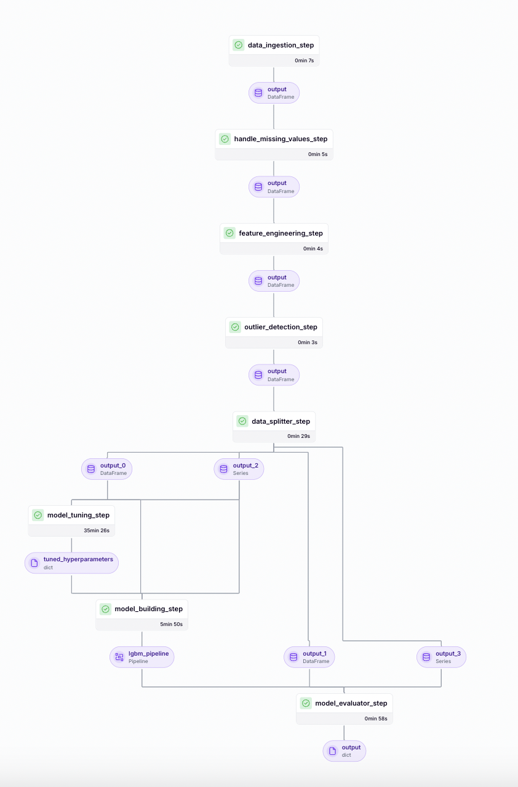

# Loan-Risk-Prediction-Model-Pipeline

This repository contains a complete machine learning pipeline, covering data ingestion, preprocessing, feature engineering, outlier detection, data splitting, model hyperparameter tuning, training, evaluation, and deployment using FastAPI. The pipeline also includes unit and integration tests to ensure the robustness of each component.


## Pipeline Diagram



## Project Structure

```
MLE/
│── analysis/                  # Exploratory Data Analysis (EDA) and feature analysis  
│   ├── analyze_src/           # Source files for analysis  
│   │   ├── basic_data_inspection.py  
│   │   ├── bivariate_analysis.py  
│   │   ├── missing_values_analysis.py  
│   │   ├── multivariate_analysis.py  
│   │   ├── univariate_analysis.py  
│   ├── EDA.ipynb              # Jupyter notebook for data exploration  
│  │  
│── models/                    # Saved models and encoders  
│   ├── final_model.pkl  
│   ├── label_encoder.pkl  
│   ├── preprocessor.pkl  
│  
│── pipelines/                 # ML pipelines for training and deployment  
│   ├── deployment_pipeline.py  
│   ├── training_pipeline.py  
│  
│── src/                       # Core ML processing scripts  
│   ├── data_splitter.py       # Splits dataset into train/test sets  
│   ├── feature_engineering.py # Feature engineering methods  
│   ├── handle_missing_values.py      # Handles missing values  
│   ├── ingest_data.py         # Data ingestion scripts  
│   ├── model_evaluation.py    # Model evaluation scripts  
│   ├── outlier_detection.py   # Outlier detection methods  
│  
│── steps/                     # Modular ML workflow steps  
│   ├── data_ingestion_step.py  
│   ├── data_splitter_step.py  
│   ├── dynamic_importer.py  
│   ├── feature_engineering_step.py  
│   ├── handle_missing_values_step.py  
│   ├── model_building_step.py  
│   ├── model_evaluator_step.py  
│   ├── model_loader.py  
│   ├── model_tuning_step.py  
│   ├── outlier_detection_step.py  
│   ├── prediction_service_loader.py  
│   ├── predictor.py  

│  
│── tests/                     # Unit tests for ML pipeline  
│   ├── test_data_ingestion.py  
│   
│── config.py                   # Configuration settings  
│── Dockerfile                   # Docker configuration for deployment  
│── LICENSE                      # License file  
│── main.py                      # Entry point for running the pipeline  
│── README.md                     # Project overview and setup instructions  
│── requirements.txt              # Dependencies and package requirements  
│── run_deployment.py             # Script to deploy the model  
│── run_pipeline.py               # Script to execute the ML pipeline  

```


## Setup and Installation

### 1. Clone the Repository

```bash
git clone https://github.com/yourusername/Loan-Risk-Prediction-Model-Pipeline.git
```


### 2. Create and Activate a Virtual Environment
```bash
python -m venv venv
source venv/bin/activate
```
### 3. Install the Dependencies
```bash
pip install -r requirements.txt
```


## Running the Pipeline
To run and deploy the machine learning pipeline (including data ingestion, preprocessing, model training, and evaluation), execute the following command:

```bash
python run_deployment.py
```
This process will ingest and preprocess the data, perform feature engineering, detect and remove outliers, split the data, conduct hyperparameter tuning, train the model, save the final model to the models/ directory, evaluate the model, and deploy the machine learning pipeline using ZenML and MLflow.


## Running the FastAPI Application (Deployment)
To deploy the FastAPI application for making predictions:

```bash
uvicorn main:app --reload
```
This will start the FastAPI server, which you can access at http://127.0.0.1:8090.


## Available Endpoints
- /predict: POST endpoint to make predictions. Example request body:

```json

{
  "loanAmount": 3000,
  "apr": 199,
  "nPaidOff": 0,
  "isFunded": 1,
  "state": "CA",
  "leadCost": 0,
  "payFrequency": "B",
  "originallyScheduledPaymentAmount": 6395.19
}
```
- /health: GET endpoint for health checks.


## Running the Tests
To run the unit and integration tests:

```bash
pytest
```
